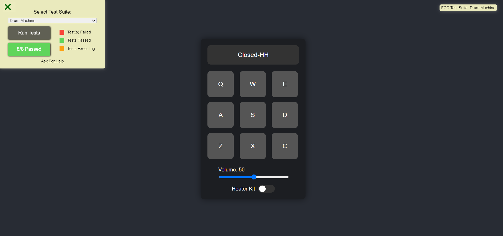

# Drum Machine

A simple drum machine web application built with React and Vite.



## Demo

You can view a live demo of the drum machine [here](https://drum-machine.hackimtech.com/).

## Features

- Nine clickable drum pads, each triggering a unique sound.
- Keyboard support for triggering sounds.
- Volume control slider.
- Bank toggle switch to switch between two sets of sounds.
- Responsive design for various screen sizes.

## Installation

To run this project locally, follow these steps:

1. Clone the repository:

   ```bash
   git clone https://github.com/hackim18/Frontend-Drum-Machine
   cd Frontend-Drum-Machine
   ```

2. Install dependencies:

   ```bash
   npm install
   ```

3. Start the development server:

   ```bash
   npm run dev
   ```

4. Open your browser and navigate to http://localhost:3000.

## Usage

- Click on the drum pads or use the corresponding keyboard keys (Q, W, E, A, S, D, Z, X, C) to trigger sounds.
- Adjust the volume using the volume control slider.
- Toggle between two banks of sounds using the bank toggle switch.

## Technologies Used

- React
- Vite
- HTML/CSS
- JavaScript

## Credits

- Sound samples from FreeCodeCamp Drum Machine.

## License

This project is licensed under the MIT License - see the LICENSE file for details.
